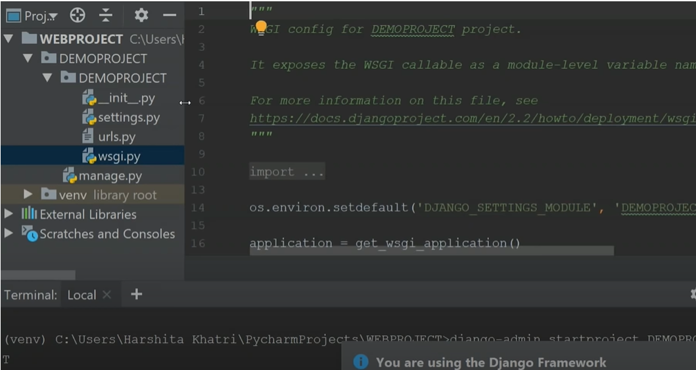
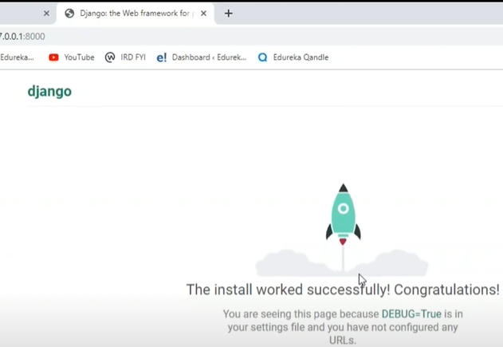
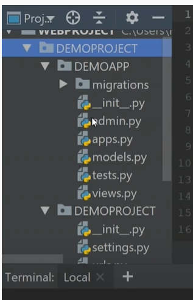

# Django

[Edureka tutorial](https://www.youtube.com/watch?v=zuxzE7--RYM&t=1036s)

[Tutuorialspoint](https://www.tutorialspoint.com/django/index.htm)

## Step 1: Installing Django

    $pip install django

## Step 2: Database Setup
    
Django supports several major database engines and you can set up any of them based on your comfort.

* MySQL (http://www.mysql.com/)
* PostgreSQL (http://www.postgresql.org/)
* SQLite 3 (http://www.sqlite.org/)
* Oracle (http://www.oracle.com/)
* MongoDb (https://django-mongodb-engine.readthedocs.org)
* GoogleAppEngine Datastore (https://cloud.google.com/appengine/articles/django-nonrel)
* You can refer to respective documentation to installing and configuring a database of your choice.

Note − Number 5 and 6 are NoSQL databases.

## Step 3: Create a Project

    $django-admin startproject <project-name> { Here, project-name = DEMOPROJECT }
    

     DEMOPROJECT/
        DEMOPROJECT/
            __init__.py
            settings.py
            urls.py
            wsgi.py
        manage.py
### The Project Structure

The “DEMOPROJECT” folder is just our project container, it actually contains two elements −

* The “myproject” subfolder : This folder is the actual python package of our project. It contains 4 files −

__init__.py : Just for python, treat this folder as package.

settings.py : As the name indicates, our project settings.

urls.py : All links of your project and the function to call. A kind of ToC of our project.

wsgi.py : If we need to deploy our project over WSGI.
    
* manage.py: This file is kind of your project local django-admin for interacting with your project via command line (start the development server, sync db...). 

## Step 4: Setting Up Our Project

Our project is set up in the subfolder myproject/settings.py.

    DEBUG = True

This option tells whether project is in debug mode or not. Debug mode help us to get more information about our project's error. Never set it to ‘True’ for a live project. However, this has to be set to ‘True’ if we want the Django light server to serve static files. Do it only in the development mode.

    DATABASES = {
       'default': {
          'ENGINE': 'django.db.backends.sqlite3',
          'NAME': 'database.sql',
          'USER': '',
          'PASSWORD': '',
          'HOST': '',
          'PORT': '',
       }
    }
    
Database is set in the ‘Database’ dictionary. The example above is for SQLite engine. Before setting any new engine, make sure we have the correct db driver installed. We can also set others options like: TIME_ZONE, LANGUAGE_CODE, TEMPLATE…

Now that your project is created and configured make sure it's working :

    $cd DEMOPROJECT
    $python manage.py runserver

## Step 5: Create an Application

     $python manage.py startapp DEMOAPP { Here, DEMOAPP = App name }
     
We just created DEMOAPP application and like project, Django create a “DEMOAPP” folder with the application structure:

    DEMOAPP/
       __init__.py
       admin.py
       models.py
       tests.py
       views.py
       
* __init__.py − Just to make sure python handles this folder as a package.

* admin.py − This file helps you make the app modifiable in the admin interface.

* models.py − This is where all the application models are stored.

* tests.py − This is where your unit tests are.

* views.py − This is where your application views are.
        

## Step 6: Get the Project to Know About Our Application

At this stage we have our "DEMOAPP" application, now we need to register it with our Django project "myproject". To do so, update INSTALLED_APPS tuple in the settings.py file of our project (add our app name):

    INSTALLED_APPS = (
       'django.contrib.admin',
       'django.contrib.auth',
       'django.contrib.contenttypes',
       'django.contrib.sessions',
       'django.contrib.messages',
       'django.contrib.staticfiles',
       'myapp',
    )
